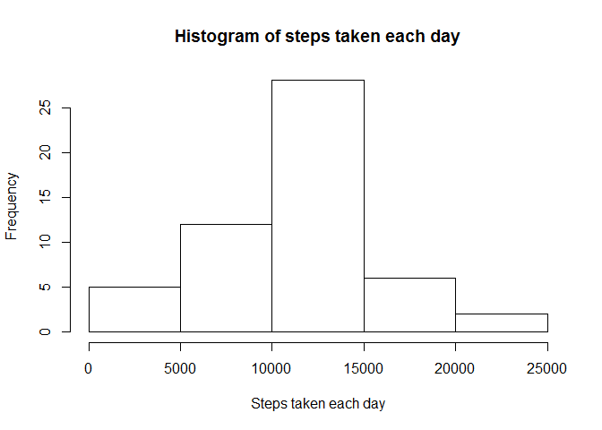
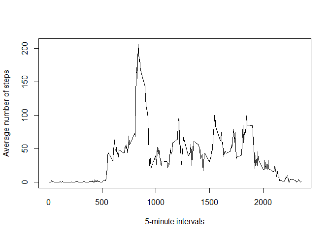
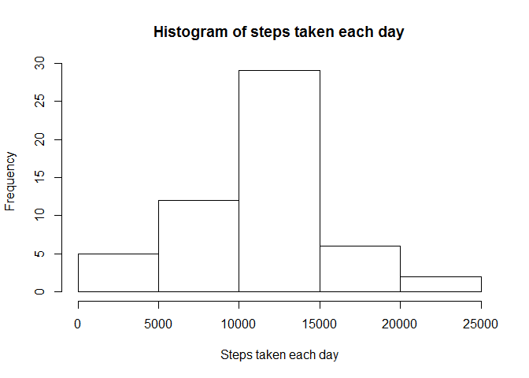
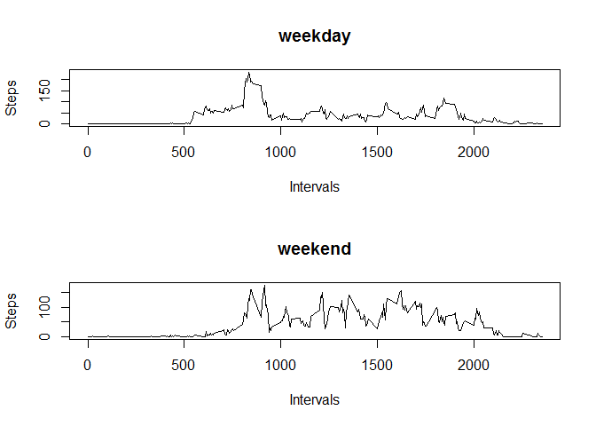

# Reproducible Research: Peer Assessment 1


## Loading and preprocessing the data


```r
dat <- read.csv(unzip('activity.zip'), header=T)

head(dat)
```

```
##   steps       date interval
## 1    NA 2012-10-01        0
## 2    NA 2012-10-01        5
## 3    NA 2012-10-01       10
## 4    NA 2012-10-01       15
## 5    NA 2012-10-01       20
## 6    NA 2012-10-01       25
```

```r
str(dat)
```

```
## 'data.frame':	17568 obs. of  3 variables:
##  $ steps   : int  NA NA NA NA NA NA NA NA NA NA ...
##  $ date    : Factor w/ 61 levels "2012-10-01","2012-10-02",..: 1 1 1 1 1 1 1 1 1 1 ...
##  $ interval: int  0 5 10 15 20 25 30 35 40 45 ...
```

```r
dat$date <- as.Date(dat$date, '%Y-%m-%d')
str(dat)
```

```
## 'data.frame':	17568 obs. of  3 variables:
##  $ steps   : int  NA NA NA NA NA NA NA NA NA NA ...
##  $ date    : Date, format: "2012-10-01" "2012-10-01" ...
##  $ interval: int  0 5 10 15 20 25 30 35 40 45 ...
```

## What is mean total number of steps taken per day?

Calculate the total number of steps taken per day


```r
sums <- aggregate(steps~date, na.omit(dat), sum)
head(sums)
```

```
##         date steps
## 1 2012-10-02   126
## 2 2012-10-03 11352
## 3 2012-10-04 12116
## 4 2012-10-05 13294
## 5 2012-10-06 15420
## 6 2012-10-07 11015
```
Make a histogram of the total number of steps taken each day

```r
hist(sums$steps, main='Histogram of steps taken each day', xlab='Steps taken each day')
```

\
Calculate and report the mean and median of the total number of steps taken per day

```r
mean(sums$steps)
```

```
## [1] 10766.19
```

```r
median(sums$steps)
```

```
## [1] 10765
```

## What is the average daily activity pattern?

Make a time series plot (i.e. type = "l") of the 5-minute interval (x-axis) and the average number of steps taken, averaged across all days (y-axis)

```r
intervals <- aggregate(steps~interval, na.omit(dat),mean)

plot(intervals$interval, intervals$steps, type='l', xlab='5-minute intervals', ylab='Average number of steps')
```

\
Which 5-minute interval, on average across all the days in the dataset, contains the maximum number of steps?

```r
intervals[intervals$steps==max(intervals$steps),]
```

```
##     interval    steps
## 104      835 206.1698
```

## Imputing missing values

Calculate and report the total number of missing values in the dataset (i.e. the total number of rows with NAs)

```r
nrow(dat) - nrow(na.omit(dat))
```

```
## [1] 2304
```
Create a new dataset that is equal to the original dataset but with the missing data filled in.

```r
datNA <- dat

datNA[is.na(datNA$steps),]$steps <- intervals[intervals$interval==datNA[is.na(datNA$steps),]$interval,2]
head(datNA)
```

```
##       steps       date interval
## 1 1.7169811 2012-10-01        0
## 2 0.3396226 2012-10-01        5
## 3 0.1320755 2012-10-01       10
## 4 0.1509434 2012-10-01       15
## 5 0.0754717 2012-10-01       20
## 6 2.0943396 2012-10-01       25
```
Make a histogram of the total number of steps taken each day

```r
sums2 <- aggregate(steps~date, datNA, sum)
hist(sums2$steps, main='Histogram of steps taken each day', xlab='Steps taken each day')
```

\
Calculate and report the mean and median total number of steps taken per day

```r
mean(sums2$steps)
```

```
## [1] 10766.19
```

```r
median(sums2$steps)
```

```
## [1] 10765.59
```
Do these values differ from the estimates from the first part of the assignment? What is the impact of imputing missing data on the estimates of the total daily number of steps?

Mean is the same, median is closer to mean. Imputing missing data smooth total daily number of steps.

## Are there differences in activity patterns between weekdays and weekends?

Create a new factor variable in the dataset with two levels – “weekday” and “weekend” indicating whether a given date is a weekday or weekend day.


```r
datNA$day <- ''
datNA[,4] <- 'weekday'
datNA[(weekdays(datNA$date,T)=='Сб')|(weekdays(datNA$date,T)=='Вс'),4] <- 'weekend'
datNA$day <- as.factor(datNA$day)
str(datNA)
```

```
## 'data.frame':	17568 obs. of  4 variables:
##  $ steps   : num  1.717 0.3396 0.1321 0.1509 0.0755 ...
##  $ date    : Date, format: "2012-10-01" "2012-10-01" ...
##  $ interval: int  0 5 10 15 20 25 30 35 40 45 ...
##  $ day     : Factor w/ 2 levels "weekday","weekend": 1 1 1 1 1 1 1 1 1 1 ...
```
Make a panel plot containing a time series plot (i.e. type = "l") of the 5-minute interval (x-axis) and the average number of steps taken, averaged across all weekday days or weekend days (y-axis)

```r
weekday_mean_steps <- aggregate(steps~interval, datNA[datNA$day=='weekday',], mean)
weekend_mean_steps <- aggregate(steps~interval, datNA[datNA$day=='weekend',], mean)

par(mfcol=c(2,1))
plot(weekday_mean_steps$interval, weekday_mean_steps$steps, type='l', main='weekday', xlab='Intervals', ylab='Steps')
plot(weekend_mean_steps$interval, weekend_mean_steps$steps, type='l', main='weekend', xlab='Intervals', ylab='Steps')
```

\
